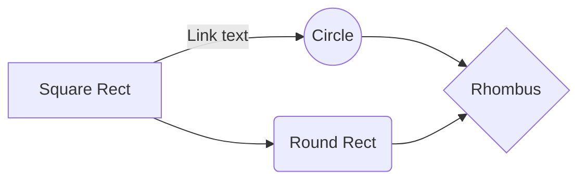

# 功能扩展

## 提示窗美化 —— 已完成 2021-03-04

> [!NOTE]
> An alert of type 'note' using global style 'callout'.

> [!TIP]
> An alert of type 'tip' using global style 'callout'.

> [!WARNING]
> An alert of type 'warning' using global style 'callout'.

> [!ATTENTION]
> An alert of type 'attention' using global style 'callout'.

## Markdown 高级语法

### 任务列表
- [ ] foo
- bar
- [x] baz
- [ ] bam <~ not working
  - [ ] bim
  - [ ] lim

### 缩放/展开列表

字母（点击展开）

- Abc
- Abc

### 文本

<mark>Marked text</mark>

## 阅读进度条 —— 已完成 2021-03-04

## Valine 评论

## 阅读时长 & 字数统计

## google 统计

## 运行时间统计

## 访问量统计

## 前后章节跳转 —— 已完成 2021-03-05

## 回到顶部

## 侧边栏目录折叠

## TOC 目录 —— 已完成 2021-03-13

暂时和 Valine 评论有冲突

## dark 模式 —— 未完成 2021-03-05
待调试

## 社交分享

## 图片点击放大 —— 已完成 2021-03-05

## mermaid 作图 —— 已完成 2021-03-05

原参考链接文档错了。

## 中英文添加空格 —— 已完成 2021-03-05
`测试：hello世界1234   哈哈  hehe`

测试：hello世界1234   哈哈  hehe

## font-awesome

## 代码复制

## 加载远端 markdown 文件

## 文内 Tab —— 未实现

<!-- tabs:start -->

<!-- tab:English -->

Hello!

<!-- tab:French -->

Bonjour!

<!-- tab:Italian -->

Ciao!

<!-- tabs:end -->

## 文内 Slide

## 内嵌 GIF

## 内嵌 echarts

## 内嵌视频

## 内嵌 pdf  —— 已完成 2021-03-13

## 支持 LaTex 数学公式 —— 已完成 2021-03-30

$$
\left[
\begin{matrix}
 1      & 2      & \cdots & 4      \\
 7      & 6      & \cdots & 5      \\
 \vdots & \vdots & \ddots & \vdots \\
 8      & 9      & \cdots & 0      \\
\end{matrix}
\right]
$$

## 预加载提示

## Top banner 提示

## 左上角优化

## 右下角 live2d 展示

## emoji

## 文末打赏功能

## 自定义

## ······

## 参考

[awesome-docsify: Plugins](https://github.com/docsifyjs/awesome-docsify#plugins)

[mermaid manual](https://mermaid-js.github.io/mermaid/#/)

[markdown-cheatsheet](https://github.com/tchapi/markdown-cheatsheet)

[docsify-themeable](https://jhildenbiddle.github.io/docsify-themeable/#/)