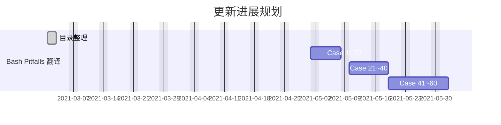
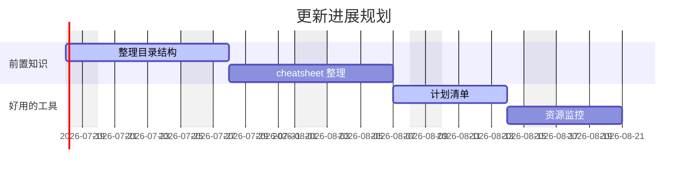
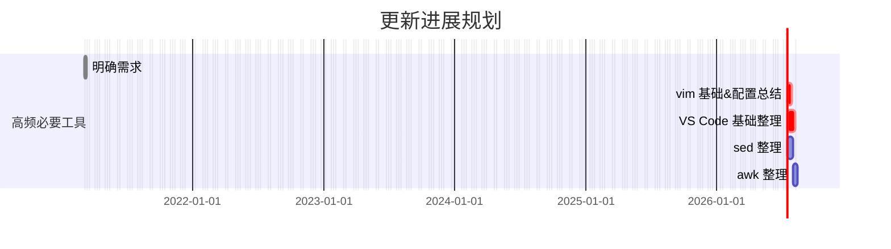

# 更新计划

<!-- # 待办列表

## 脚本编程部分



## 最佳实践部分



## 高效工具部分

## 必备技能部分



## 操作系统部分

## 性能优化部分

```mermaid
gantt
    dateFormat  YYYY-MM-DD
    title       更新进展规划
    excludes    weekends
    %% (`excludes` accepts specific dates in YYYY-MM-DD format, days of the week ("sunday") or "weekends", but not the word "weekdays".)

    section Linux 性能优化
    目录整理                             : done,          task_1, 2021-03-04, 3d
    CPU 篇                               : crit,         task_2, 2021-03-06, 12d
    内存篇                               :                task_3, after task_2, 16d
    磁盘 I/O 篇                          :                task_4, after task_3, 20d
    网络篇                               : crit,          task_5, after task_4, 20d
    综合篇                               : crit,          task_6, after task_5, 20d
``` -->
