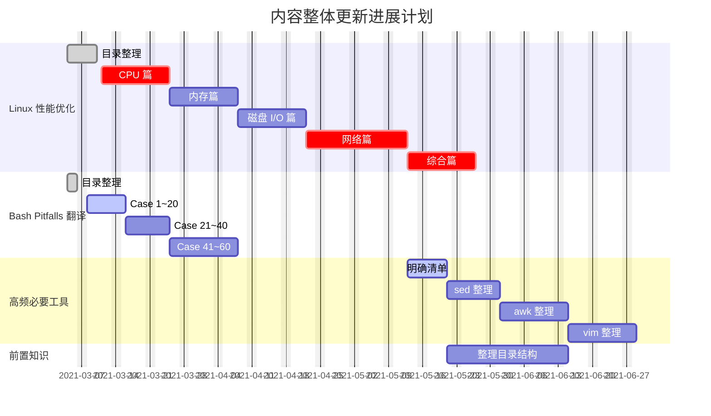

# 待办清单

<!-- ## 内容新增

### Linux 性能优化实战笔记及拓展

### Bash Pitfalls 翻译完结

### github 仓库整理

### 调整访问方式 -->

## 内容规划

## 功能插件扩展

### 提示窗美化 —— 已完成 2021-03-04

> [!NOTE]
> An alert of type 'note' using global style 'callout'.

> [!TIP]
> An alert of type 'tip' using global style 'callout'.

> [!WARNING]
> An alert of type 'warning' using global style 'callout'.

> [!ATTENTION]
> An alert of type 'attention' using global style 'callout'.

### 阅读进度条 —— 已完成 2021-03-04

### Valine 评论

### 阅读时长 & 字数统计

### google 统计

### 运行时间统计

### 访问量统计

### 前后章节跳转 —— 已完成 2021-03-05

### 回到顶部

### 侧边栏目录折叠

### TOC 目录

### dark 模式 —— 未完成 2021-03-05
待调试

### 社交分享

### 图片点击放大 —— 已完成 2021-03-05

### mermaid 作图 —— 已完成 2021-03-05
原参考链接文档错了。

### 中英文添加空格 —— 已完成 2021-03-05
`测试：hello世界1234   哈哈  hehe`

测试：hello世界1234   哈哈  hehe

### font-awesome

### 代码复制

### 加载远端 markdown 文件

### 文内 Tab

### 文内 Slide

### 内嵌 GIF

### 内嵌 echarts

### 内嵌视频

### 内嵌 pdf

### 预加载提示

### Top banner 提示

### 左上角优化

### 右下角 live2d 展示

### emoji

### 文末打赏功能

### ······

## 参考

[awesome-docsify: Plugins](https://github.com/docsifyjs/awesome-docsify#plugins)

[mermaid manual](https://mermaid-js.github.io/mermaid/#/)

[markdown-cheatsheet](https://github.com/tchapi/markdown-cheatsheet)